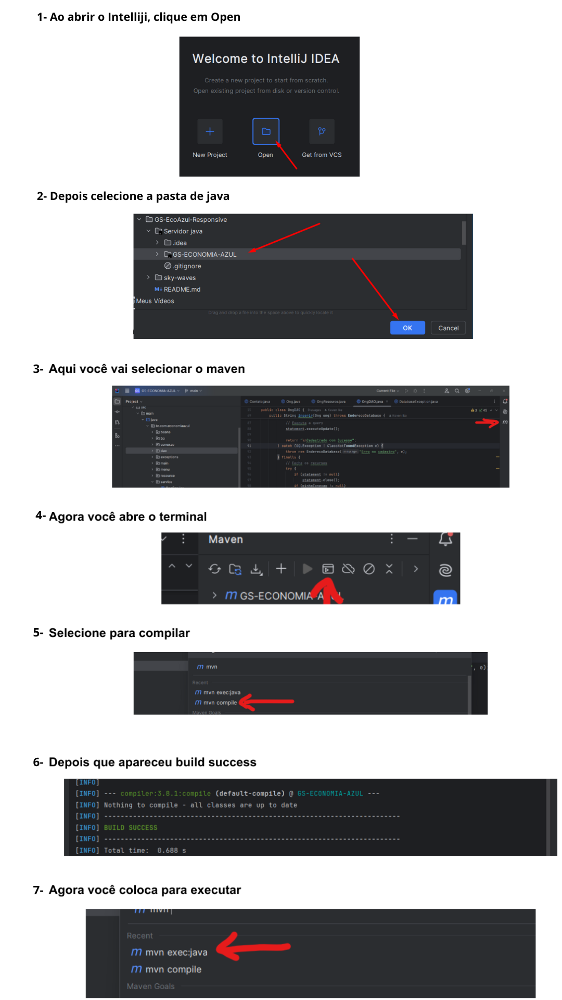

# GS-EcoAzul-Responsive
Repositório para os codigos da GS de front-end sobre Economia Azul - FIAP - 1/24

Vídeo demonstrativo:
https://youtu.be/Fheq1o-OGt0

Link do GitHub:
https://github.com/LAmatteoni/GS-EcoAzul-Responsive

Link da Vercel:
https://sky-waves.vercel.app/

### Atenção, leia as instruções abaixo para ligar a API de java:
